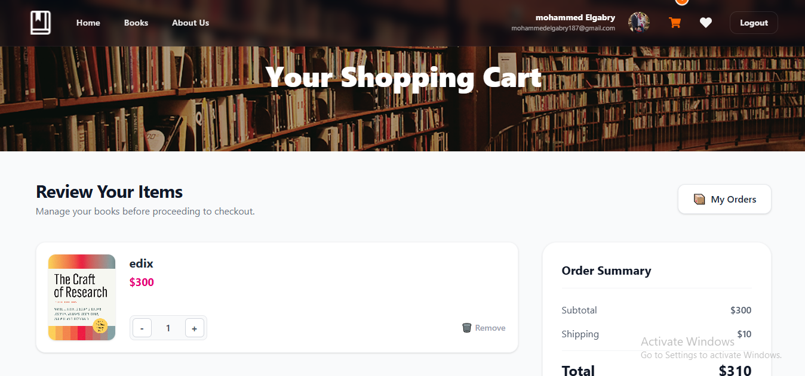
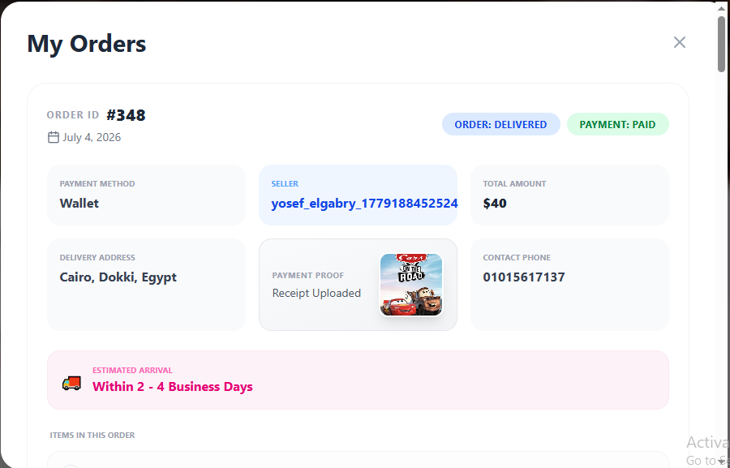
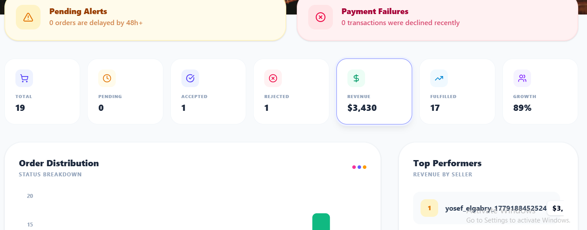
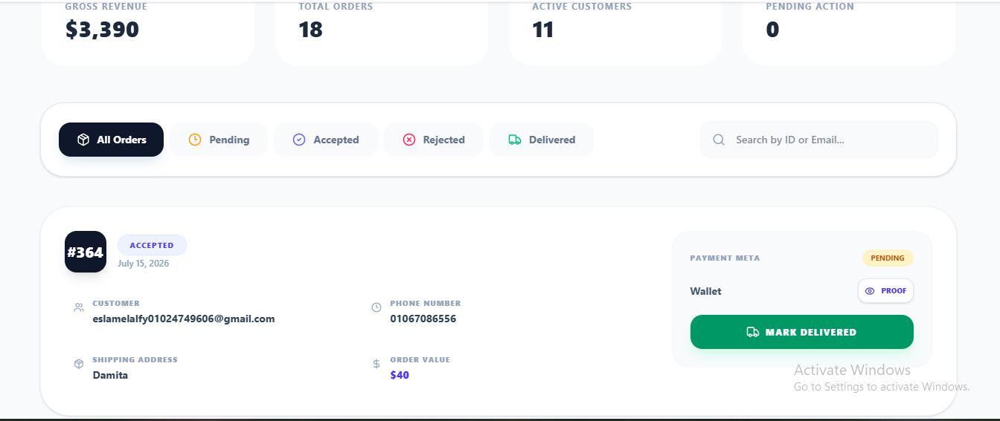
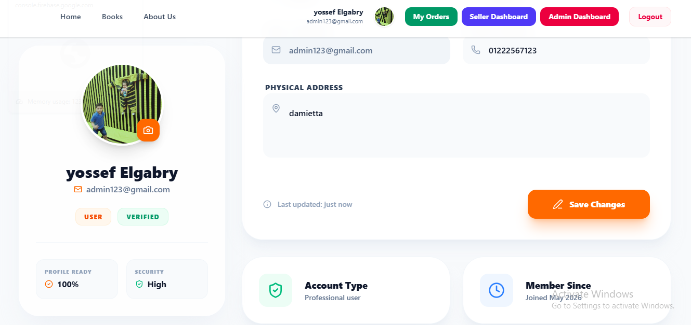

# 📚 Book Shop
### Full Stack E-Commerce Web Application

A modern, scalable, and responsive online bookstore built with **React.js**, **Strapi CMS**, **Zustand**, and **Tailwind CSS**.

 

### 🌐 Live Demo

## 👉 http://162.35.172.155/

---

# 📖 About

Book Shop is a complete Full Stack E-Commerce application designed to simulate a real-world online bookstore.

Users can browse books, create accounts, authenticate securely, manage shopping carts and wishlists, place orders using multiple payment methods, and track their order history.

The application follows a modern frontend architecture using reusable components, centralized state management with Zustand, and a Headless CMS backend powered by Strapi.

The project focuses on clean architecture, scalability, responsive design, maintainability, and implementing real business workflows.

---

# ✨ Features

## 👤 Authentication

- User Registration
- User Login
- Google Login Integration
- JWT Authentication
- Protected Routes
- Persistent Authentication

---

## 📚 Books

- Browse Books
- Book Details
- Categories
- Search
- Filtering
- Pagination
- Recommended Books
- Flash Sales

---

## ❤️ Wishlist

- Add Books to Wishlist
- Remove Books
- Persistent Wishlist

---

## 🛒 Shopping Cart

- Add Books
- Remove Books
- Update Quantity
- Dynamic Price Calculation
- Backend Cart Synchronization

---

## 💳 Checkout & Payments

Multiple payment methods:

- Cash Payment
- Wallet Payment
- Visa Mock Payment Flow

Features:

- Checkout Session Creation
- Order Creation
- Payment Status Management
- Cart Clearing After Successful Payment

---

## 📦 Orders

- Create Orders
- Order History
- Order Details
- Payment Status Tracking

---

## 👤 User Profile

- Profile Management
- Update Personal Information
- User Dashboard

---

## 🧑‍💼 Seller Dashboard

- Sales Overview
- Orders Management

---

## 🛠️ Admin Dashboard

- Dashboard Statistics
- Users Management
- Products Management
- Orders Management
- CMS Integration

---

## 📱 Responsive Design

Fully optimized for:

- Desktop
- Tablet
- Mobile

Built with Tailwind CSS.

---

# 🛠 Tech Stack

## Frontend

- React.js
- JavaScript (ES6+)
- React Router DOM
- Tailwind CSS
- Zustand
- Axios
- Formik
- Yup
- Swiper.js
- GSAP
- Animate.css
- React Icons
- Lucide React

---

## Backend

- Strapi CMS
- REST API
- JWT Authentication

---

## Deployment

- VPS
- Ubuntu
- Nginx
- PM2

---

# 📸 Screenshots

## 🏠 Home Page

---

## 📚 Books Page

---

## 📦 Order Details

---

## 👤 User Dashboard

---

## 🛠️ Admin Dashboard

---

## 🛍️ Seller Dashboard

---

## 👤 Profile Page

---

# 🚀 Deployment Architecture

## Frontend

- React + Vite Build
- Nginx Hosting

## Backend

- Strapi CMS
- PM2 Process Manager
- Nginx Reverse Proxy

## Server

- Ubuntu VPS

---

# 📂 Project Structure
